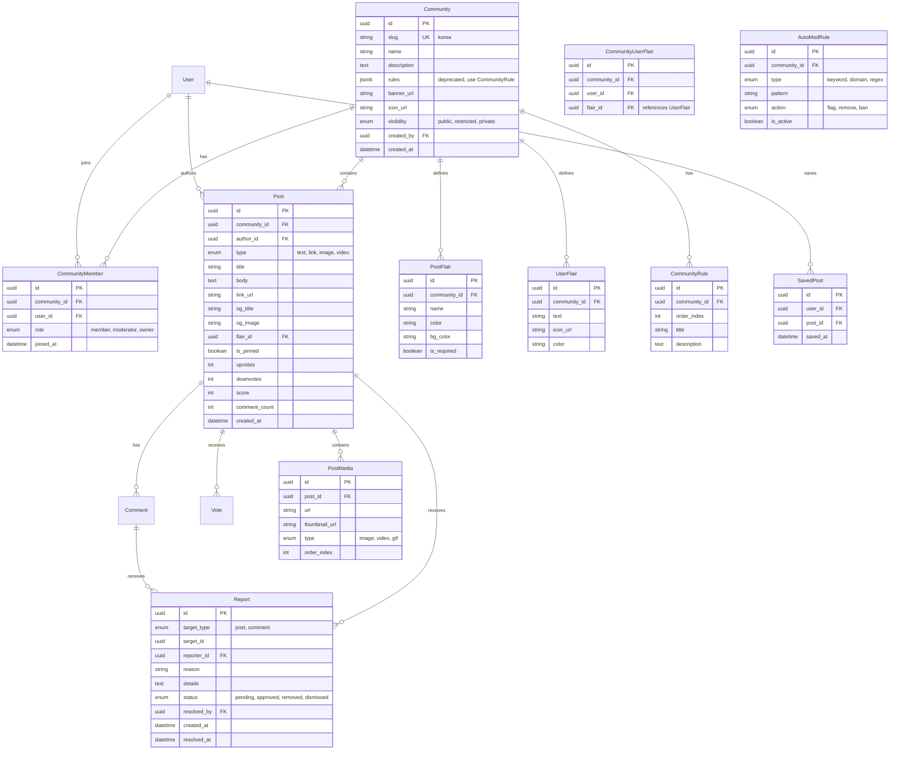

# Spec 023: Subreddit-style Community (r/korea Model)

## 1. Product Goal
To provide a specialized, community-driven platform for Korean IT professionals in Japan, modeled after the intuitive and proven structure of Reddit (specifically `r/korea`). The goal is to move beyond simple "bulletin boards" to "managed communities" that support growth, engagement, and self-regulation.

### Core Value Proposition
- **Managed Context**: Each community (`r/{slug}`) has its own identity, rules, and culture.
- **Scannability**: A dense, media-rich feed that is easy to consume (Cards > Tables).
- **Self-Regulation**: Voting and Moderation tools ensure high-quality content without central bottlenecks.

---

## 2. User Stories

### Member (User)
- As a user, I want to **browse communities** and see their member counts and descriptions before joining.
- As a user, I want to **join/leave** communities so I can customize my home feed.
- As a user, I want to **post (Text, Link, Image)** to a specific community to share information.
- As a user, I want to **flair** my posts so others can filter by topic (e.g., "비자", "생활팁").
- As a user, I want to **vote** on posts and comments to help good content rise.
- As a user, I want to **save** posts I want to revisit later.
- As a user, I want to **report** content that violates community rules.
- As a user, I want to see a **personalized home feed** aggregating posts from communities I've joined.

### Moderator (Mod)
- As a mod, I want to **customize** my community (Banner, Icon, Description, Rules).
- As a mod, I want to **review reported content** in a queue and take action (Approve, Remove).
- As a mod, I want to **pin** important posts to the top of the feed (max 2).
- As a mod, I want to **manage flairs** (Post and User flairs) to organize content.
- As a mod, I want to **set posting restrictions** (e.g., require certain account age/karma).
- As a mod, I want to **view community statistics** (joins, leaves, post frequency).

### Admin (System)
- As an admin, I want to **create** official communities (e.g., `r/공지`, `r/취준생`).
- As an admin, I want to **ban** malicious users globally across all communities.
- As an admin, I want to **feature** communities on the homepage.

---

## 3. Screens & UX

### 3.1 Global Navigation
- **Top Bar**: Search (Context-aware: global vs in-community), User Menu (Profile, Settings, Saved), Create Post Button.
- **Left Sidebar** (Desktop Only):
    - **Feeds**: Home (Joined), Popular (All), Explore.
    - **My Communities**: List of joined `r/{slug}` with unread indicators.
    - **Recent**: Recently visited communities (max 5).
    - **Moderation**: Quick access to mod queue (if mod of any community).

### 3.2 Community Home (`/r/:slug`)
- **Header**: 
    - Large Banner image (1500x500 recommended).
    - Circular Icon (256x256).
    - Community Name + Short Description.
    - "Join/Joined" toggle button.
    - Member count + Online count.
- **Tabs**: Posts | Wiki (V1) | Rules
- **Filters**: Hot / New / Top (Today/Week/Month/Year/All).
- **Feed**: List of `PostCard` components.
    - **PostCard Anatomy**:
        - Vote controls (left, vertical).
        - Content summary (center): Flair badge, Title, Author, Timestamp, Content preview.
        - Thumbnail (right, optional for link/image posts).
        - Action bar: Comments count, Share, Save, Report (dropdown).
- **Right Sidebar** (Desktop Only):
    - **About Card**: Description, Created date, Member stats.
    - **Community Highlights**: Up to 2 pinned/announcement posts.
    - **Rules Accordion**: Numbered list of community rules.
    - **User Flair Preview**: "Your flair: [icon] Label" with edit option.
    - **Related Communities**: Links to similar `r/{slug}`.
    - **Ads Slot**: Google Ads (300x250).

### 3.3 Post Detail (`/r/:slug/comments/:postId/:seo-slug?`)
- **Layout**: Two-column layout (Main Content + Sidebar).
- **Main Content**:
    - Full post (expanded text/image/link preview).
    - Vote controls (horizontal on mobile, vertical on desktop).
    - Author info with User Flair.
    - Action bar: Comments, Share, Save, Report, Crosspost (V2).
- **Comments Section**:
    - Comment form (top, if logged in).
    - Sort options: Best / Top / New / Controversial.
    - Threaded view with collapse toggles.
    - "Load more replies" for deep threads.
- **Sidebar**: Same as Community Home.

### 3.4 Post Creation (`/r/:slug/submit`)
- **Form**:
    - Post Type selector: Text / Link / Image.
    - Title (required, max 300 chars).
    - Body (Markdown editor for Text posts) / URL input (for Link) / Image uploader.
    - Flair selector (dropdown, may be required by community).
    - NSFW/Spoiler toggles (V1).
- **Preview Mode**: Live preview of post rendering.
- **Submit Button**: Disabled until all required fields are valid.

### 3.5 Mod Dashboard (`/r/:slug/about/modqueue`)
- **Tabs**: Mod Queue | Spam | Edited | Unmoderated
- **Queue Item**:
    - Content preview (Title + snippet).
    - Report reason + reporter count.
    - Author info + history link.
    - Actions: Approve, Remove, Spam, Ban User (with reason modal).
- **Bulk Actions**: Select multiple + batch Approve/Remove.

### 3.6 Community Settings (`/r/:slug/about/edit`) (Mod Only)
- **Sections**:
    - Display: Name, Description, Icon, Banner upload.
    - Rules: Add/Edit/Delete/Reorder rules.
    - Flairs: Manage Post Flairs + User Flairs.
    - Posting: Allowed post types, required flair, minimum account age.
    - Mods: Invite/Remove moderators.

---

## 4. Feature Scope

### Phase 1: MVP (Usable Foundations) - 2 Weeks
| Feature | Description | File(s) |
|:--------|:------------|:--------|
| Community Entity | Create/Edit basic details | `schema.ts`, `community.server.ts` |
| Join/Leave | Membership management | `api.community.join.ts` |
| Community Feed | Posts sorted by New/Hot | `r.$slug._index.tsx` |
| Global Home Feed | Aggregated from joined communities | `community.tsx` (updated) |
| Post CRUD | Text, Link, Single Image | `r.$slug.submit.tsx` |
| Voting | Up/Down on posts (reuse existing) | `VoteControl.tsx` |
| Comments | Reuse existing threaded comments | `CommentThread.tsx` |
| Pinned Posts | Mod can pin 1-2 posts | `community.server.ts` |
| Basic Report | Report button → Stores in DB | `reports` table |

### Phase 2: V1 (Visuals & Organization) - 2 Weeks
| Feature | Description | File(s) |
|:--------|:------------|:--------|
| Post Flairs | Colored tags, filterable | `post_flairs` table, `FlairBadge.tsx` |
| User Flairs | Community-specific user badges | `user_flairs` table |
| Rich Media | Multi-image gallery, OG previews | `PostMedia.tsx`, `og-scraper.server.ts` |
| Mod Queue | Dashboard for reported content | `r.$slug.about.modqueue.tsx` |
| AutoMod V1 | Keyword filter rules | `automod_rules` table |
| Scoped Search | Search within community | `r.$slug.search.tsx` |
| Top Sort | With time range filter | `SortControl.tsx` enhancement |

### Phase 3: V2 (Growth & Refinement) - 2+ Weeks
| Feature | Description | Notes |
|:--------|:------------|:------|
| Trending | Algorithm for rising communities | Background job |
| Crosspost | Share to another community | UI + API |
| Analytics | Traffic stats for Mods | `mod-analytics.server.ts` |
| Notifications | Push for replies/mentions | Integrate with existing push system |
| Ads | Sponsored posts, sidebar ads | Requires policy |

---

## 5. Data Model & Permissions

### 5.1 ER Diagram (Complete)



### 5.2 Permissions Matrix
| Action | Guest | Member | Moderator | Admin |
|:-------|:-----:|:------:|:---------:|:-----:|
| View Public Feed | ✅ | ✅ | ✅ | ✅ |
| View Restricted Feed | ❌ | ✅ | ✅ | ✅ |
| Join Community | ❌ | ✅ | ✅ | ✅ |
| Create Post | ❌ | ✅ | ✅ | ✅ |
| Edit Own Post | ❌ | ✅ | ✅ | ✅ |
| Delete Own Post | ❌ | ✅ | ✅ | ✅ |
| Vote | ❌ | ✅ | ✅ | ✅ |
| Report Content | ❌ | ✅ | ✅ | ✅ |
| Pin Post | ❌ | ❌ | ✅ | ✅ |
| Delete Any Post | ❌ | ❌ | ✅ | ✅ |
| Manage Flairs | ❌ | ❌ | ✅ | ✅ |
| Ban User (Community) | ❌ | ❌ | ✅ | ✅ |
| Edit Community | ❌ | ❌ | ✅ | ✅ |
| Ban User (Global) | ❌ | ❌ | ❌ | ✅ |
| Feature Community | ❌ | ❌ | ❌ | ✅ |

---

## 6. API Routes

### 6.1 Community APIs
| Method | Route | Description | Auth |
|:-------|:------|:------------|:-----|
| GET | `/api/communities` | List all public communities | None |
| GET | `/api/communities/:slug` | Get community details | None |
| POST | `/api/communities` | Create new community | User |
| PATCH | `/api/communities/:slug` | Update community | Mod |
| POST | `/api/communities/:slug/join` | Join community | User |
| POST | `/api/communities/:slug/leave` | Leave community | User |
| GET | `/api/communities/:slug/members` | List members | Mod |
| POST | `/api/communities/:slug/mods` | Add moderator | Mod |

### 6.2 Post APIs
| Method | Route | Description | Auth |
|:-------|:------|:------------|:-----|
| GET | `/api/communities/:slug/posts` | List posts | None |
| POST | `/api/communities/:slug/posts` | Create post | Member |
| GET | `/api/posts/:id` | Get single post | None |
| PATCH | `/api/posts/:id` | Edit post | Author |
| DELETE | `/api/posts/:id` | Delete post | Author/Mod |
| POST | `/api/posts/:id/pin` | Toggle pin | Mod |

### 6.3 Moderation APIs
| Method | Route | Description | Auth |
|:-------|:------|:------------|:-----|
| GET | `/api/communities/:slug/modqueue` | Get reported items | Mod |
| POST | `/api/reports` | Create report | User |
| PATCH | `/api/reports/:id` | Resolve report | Mod |
| POST | `/api/communities/:slug/ban` | Ban user | Mod |

---

## 7. Ranking & Sorting Algorithms

### 7.1 Hot Sort (Reddit-style Time Decay)
Default for community feeds.
```typescript
function hotScore(ups: number, downs: number, createdAt: Date): number {
  const score = ups - downs;
  const order = Math.log10(Math.max(Math.abs(score), 1));
  const sign = score > 0 ? 1 : score < 0 ? -1 : 0;
  const seconds = (createdAt.getTime() - EPOCH_MS) / 1000;
  return sign * order + seconds / 45000;
}
```
- **Effect**: Newer posts need fewer upvotes to beat older high-score posts.
- **EPOCH_MS**: Fixed date (e.g., Dec 8, 2005 - Reddit's epoch).

### 7.2 Best Sort (Wilson Score Confidence)
Default for Comment threads.
```typescript
function wilsonScore(ups: number, total: number): number {
  if (total === 0) return 0;
  const z = 1.96; // 95% confidence
  const phat = ups / total;
  return (phat + z*z/(2*total) - z * Math.sqrt((phat*(1-phat)+z*z/(4*total))/total)) / (1 + z*z/total);
}
```
- **Effect**: High confidence in quality → ranked higher than controversial.

### 7.3 New
- Simple `ORDER BY created_at DESC`.

### 7.4 Top (with Time Range)
- `ORDER BY score DESC` + `WHERE created_at > :cutoff`.

### 7.5 Controversial (V2)
- Posts with high total votes but near 50/50 split.

---

## 8. Moderation & Abuse Prevention

### 8.1 Rate Limiting
| Context | Limit |
|:--------|:------|
| New Account Post | 1 post / 10 min for first 24h |
| Comments | 1 comment / 30 sec |
| Join Requests | 10 communities / hour |
| Reports | 5 reports / hour |

### 8.2 Report System Flow
1. User clicks "Report" → Selects reason → Optionally adds details.
2. Report stored in DB with `status: pending`.
3. Mod sees report in `/r/:slug/about/modqueue`.
4. Mod actions: `Approve` (dismiss report), `Remove` (hide content), `Ban` (remove + ban user).
5. Repeated offenders can be auto-flagged.

### 8.3 AutoMod Rules (V1)
- **Keyword Filter**: Block/flag posts containing specific words.
- **Domain Filter**: Block links from specific domains.
- **Regex Match**: Advanced pattern matching.
- **Actions**: Flag for review, Auto-remove, Auto-ban.

### 8.4 Shadowban (V2)
- Spammers' posts are visible only to themselves.
- Implemented via `is_shadowbanned` field on user.

---

## 9. Migration Strategy

### 9.1 Current State Analysis
| Item | Current | Target |
|:-----|:--------|:-------|
| Table | `community_posts` | `community_posts` (enhanced) |
| Category | `category` enum ('general', 'qna', 'review') | `community_id` FK |
| Community | None | New `communities` table |
| Membership | None | New `community_members` table |

### 9.2 Migration Steps
1. **Create Schema**: Add `communities`, `community_members`, `post_flairs` tables.
2. **Seed Default Communities**:
   - `r/general` (slug: 'general', name: '자유게시판')
   - `r/qna` (slug: 'qna', name: '질문답변')
   - `r/review` (slug: 'review', name: '취업후기')
3. **Add Column**: `ALTER TABLE community_posts ADD COLUMN community_id UUID REFERENCES communities(id)`.
4. **Migrate Data**:
   ```sql
   UPDATE community_posts SET community_id = 
     (SELECT id FROM communities WHERE slug = category);
   ```
5. **Validate**: Ensure 0 rows have `NULL community_id`.
6. **Finalize**: `ALTER TABLE community_posts ALTER COLUMN community_id SET NOT NULL`.
7. **Deprecate**: Mark `category` column as deprecated (drop in future release).

### 9.3 Route Compatibility
| Old Route | New Route | Handling |
|:----------|:----------|:---------|
| `/community` | `/` or `/home` | Home feed (joined communities) |
| `/community/:postId` | `/r/:slug/comments/:postId` | Redirect with 301 |
| `/community/new` | `/r/:slug/submit` | Redirect to default community |
| `/community/search` | `/search` | Global search |

### 9.4 Rollback Plan
- Keep `category` column populated during transition.
- Feature flag: `ENABLE_SUBREDDIT_ROUTING`.
- If issues arise, revert to category-based queries.

---

## 10. File Structure

```
web/app/features/community/
├── apis/
│   ├── api.communities.ts         # CRUD for communities
│   ├── api.community.join.ts      # Join/Leave
│   ├── api.community.posts.ts     # Posts list/create
│   ├── api.posts.ts               # Single post CRUD
│   ├── api.reports.ts             # Report system
│   └── api.modqueue.ts            # Mod queue
├── components/
│   ├── CommunityHeader.tsx        # Banner + Icon + Join button
│   ├── CommunitySidebar.tsx       # About + Rules + Stats
│   ├── PostCard.tsx               # Feed item (enhanced)
│   ├── PostForm.tsx               # Create/Edit post form
│   ├── FlairBadge.tsx             # Flair display
│   ├── FlairSelector.tsx          # Flair dropdown
│   ├── SortControl.tsx            # Hot/New/Top filter
│   └── ModQueueItem.tsx           # Reported item row
├── routes/
│   ├── r.$slug.tsx                # Community layout
│   ├── r.$slug._index.tsx         # Community feed
│   ├── r.$slug.submit.tsx         # Create post
│   ├── r.$slug.comments.$postId.tsx # Post detail
│   ├── r.$slug.about.tsx          # About/Rules
│   ├── r.$slug.about.edit.tsx     # Community settings (mod)
│   ├── r.$slug.about.modqueue.tsx # Mod queue (mod)
│   └── r.$slug.search.tsx         # Scoped search
├── services/
│   ├── community.server.ts        # Community CRUD
│   ├── membership.server.ts       # Join/Leave logic
│   ├── posts.server.ts            # Post queries (enhanced)
│   ├── ranking.server.ts          # Hot/Best algorithms
│   ├── moderation.server.ts       # Reports + AutoMod
│   └── og-scraper.server.ts       # Link preview fetching
└── domain/
    ├── community.types.ts         # Type definitions
    └── community.constants.ts     # Enums, limits
```

---

## 11. Verification Plan

### 11.1 Automated Tests
- [ ] Unit: `ranking.server.ts` - Hot/Best score calculations.
- [ ] Unit: `membership.server.ts` - Join/Leave edge cases.
- [ ] Integration: Create community → Join → Post → Vote → Comment flow.
- [ ] E2E (Playwright): Full user journey from signup to first post.

### 11.2 Manual QA
- [ ] Visual: Banner/Icon cropping on different sizes.
- [ ] Visual: PostCard layout on mobile vs desktop.
- [ ] Flow: Mod queue workflow (report → review → action).
- [ ] Edge: Deeply nested comments (5+ levels).
- [ ] Edge: High-traffic community (100+ posts in feed).

### 11.3 Acceptance Criteria
- [ ] User can create and join a community.
- [ ] User can post text/link/image to joined community.
- [ ] User can vote and see score update immediately.
- [ ] Mod can pin posts and they appear at top.
- [ ] Mod can review and resolve reports.
- [ ] Migration script runs without data loss.

---

## 12. Conventions & Definitions

> Based on OpenAI review feedback for implementation clarity.

### 12.1 Slug Convention
| Context | Format | Example |
|:--------|:-------|:--------|
| Database | Lowercase, no prefix | `slug = "korea"` |
| URL | `/r/:slug` pattern | `/r/korea` |
| Display | `r/{slug}` format | `r/korea` |
| Reserved Slugs | Cannot be used | `all`, `popular`, `home`, `mod`, `admin`, `api` |

### 12.2 Role Separation
**Global Roles** (on `users` table):
| Role | Description |
|:-----|:------------|
| `user` | Standard user (default) |
| `admin` | System administrator |

**Community Roles** (on `community_members` table):
| Role | Description |
|:-----|:------------|
| `member` | Standard member, can post/vote |
| `moderator` | Can moderate content, manage settings |
| `owner` | Community creator, full control |

> ⚠️ **Do NOT mix global and community roles** - Admin has global powers but is not automatically a moderator of any community.

### 12.3 Visibility Types
| Type | Read | Write | Join |
|:-----|:-----|:------|:-----|
| `public` | Anyone | Members | Anyone |
| `restricted` | Anyone | Approved users | Request required |
| `private` | Members only | Members | Invite only |

### 12.4 Feed Definitions
| Feed | Description | Query Logic |
|:-----|:------------|:------------|
| **Home** | Posts from joined communities | `WHERE community_id IN (user's communities)` |
| **Popular** | Top posts globally (Hot sort) | `ORDER BY hot_score DESC LIMIT 50` |
| **All** | All public community posts (New) | `WHERE visibility = 'public' ORDER BY created_at DESC` |

---

## 13. Additional Data Models (OpenAI Recommendations)

### 13.1 Unified Vote Table
Replace separate `post_votes` and `comment_votes` with single table:

```sql
CREATE TABLE votes (
  id UUID PRIMARY KEY DEFAULT gen_random_uuid(),
  target_type TEXT NOT NULL CHECK (target_type IN ('post', 'comment')),
  target_id UUID NOT NULL,
  user_id UUID NOT NULL REFERENCES users(id),
  value INTEGER NOT NULL CHECK (value IN (-1, 1)),
  created_at TIMESTAMP DEFAULT NOW(),
  UNIQUE (target_type, target_id, user_id)
);
CREATE INDEX votes_target_idx ON votes(target_type, target_id);
```

### 13.2 Ban Tables (Separated)

**Community Ban** (Mod action, scoped):
```sql
CREATE TABLE community_bans (
  id UUID PRIMARY KEY DEFAULT gen_random_uuid(),
  community_id UUID NOT NULL REFERENCES communities(id),
  user_id UUID NOT NULL REFERENCES users(id),
  reason TEXT NOT NULL,
  expires_at TIMESTAMP, -- NULL = permanent
  created_by UUID NOT NULL REFERENCES users(id),
  created_at TIMESTAMP DEFAULT NOW(),
  UNIQUE (community_id, user_id)
);
```

**Global Ban** (Admin action, platform-wide):
```sql
CREATE TABLE global_bans (
  id UUID PRIMARY KEY DEFAULT gen_random_uuid(),
  user_id UUID NOT NULL REFERENCES users(id) UNIQUE,
  reason TEXT NOT NULL,
  expires_at TIMESTAMP, -- NULL = permanent
  created_by UUID NOT NULL REFERENCES users(id),
  created_at TIMESTAMP DEFAULT NOW()
);
```

### 13.3 Mod Action Log (Audit Trail)
```sql
CREATE TABLE mod_action_logs (
  id UUID PRIMARY KEY DEFAULT gen_random_uuid(),
  community_id UUID REFERENCES communities(id), -- NULL for global actions
  mod_id UUID NOT NULL REFERENCES users(id),
  action TEXT NOT NULL, -- 'approve', 'remove', 'ban', 'unban', 'pin', 'unpin', 'edit_settings'
  target_type TEXT, -- 'post', 'comment', 'user', 'community'
  target_id UUID,
  reason TEXT,
  metadata JSONB,
  created_at TIMESTAMP DEFAULT NOW()
);
CREATE INDEX mod_action_logs_community_idx ON mod_action_logs(community_id, created_at DESC);
```

### 13.4 Comment Tree Strategy
| Phase | Strategy | Implementation |
|:------|:---------|:---------------|
| MVP | Simple `parent_id` | 2-level depth only, simple recursive query |
| V1 | Materialized Path | Add `path` column (e.g., `"uuid1/uuid2/uuid3"`) |
| V2 | ltree Extension | PostgreSQL native tree indexing for deep threads |

**MVP Implementation**:
```sql
ALTER TABLE community_comments ADD COLUMN path TEXT;
-- Example path: "550e8400-e29b/a0eebc99-9c0b"
-- Query all children: WHERE path LIKE 'parent_uuid%'
```

### 13.5 Post Status Flags (for Mod Actions)
```sql
ALTER TABLE community_posts ADD COLUMN is_locked BOOLEAN DEFAULT FALSE;
ALTER TABLE community_posts ADD COLUMN removed_at TIMESTAMP;
ALTER TABLE community_posts ADD COLUMN removed_by UUID REFERENCES users(id);
ALTER TABLE community_posts ADD COLUMN removal_reason TEXT;
```

| Status | is_locked | removed_at | Display |
|:-------|:----------|:-----------|:--------|
| Normal | false | NULL | Full content |
| Locked | true | NULL | Content visible, no new comments |
| Mod Removed | - | timestamp | "[Removed by moderator]" |
| User Deleted | - | timestamp | "[Deleted by author]" |

---

## 14. Non-Functional Requirements

### 14.1 Search Strategy
| Phase | Strategy | Notes |
|:------|:---------|:------|
| MVP | PostgreSQL `ILIKE` | Simple, no setup |
| V1 | Full-Text Search (tsvector) | Already exists for posts |
| V2 | Meilisearch/Typesense | Real-time, fuzzy matching |

### 14.2 Image Storage & Processing
| Requirement | Specification |
|:------------|:--------------|
| Storage | S3 or Cloudflare R2 |
| Max Size | 10MB per image, 5 images per post |
| Formats | JPEG, PNG, GIF, WebP |
| Resizing | Generate thumbnail (300x300), preview (1200x1200) |
| Compression | Lossy JPEG 85% quality |

### 14.3 Rate Limits (Complete)
| Action | Limit | Window |
|:-------|:------|:-------|
| Login Attempts | 5 | per 15 min |
| Signup | 3 | per hour per IP |
| Post Creation | 1 | per 10 min (new accounts < 24h) |
| Post Creation | 5 | per 10 min (established) |
| Comment | 1 | per 30 sec |
| Vote | 60 | per minute |
| Report | 5 | per hour |
| Community Join | 10 | per hour |

### 14.4 Database Indexes
```sql
-- Community
CREATE UNIQUE INDEX communities_slug_idx ON communities(slug);

-- Posts
CREATE INDEX posts_community_created_idx ON community_posts(community_id, created_at DESC);
CREATE INDEX posts_community_hot_idx ON community_posts(community_id, hot_score DESC);
CREATE INDEX posts_author_idx ON community_posts(author_id);

-- Comments
CREATE INDEX comments_post_created_idx ON community_comments(post_id, created_at DESC);
CREATE INDEX comments_parent_idx ON community_comments(parent_id);

-- Votes
CREATE UNIQUE INDEX votes_unique_idx ON votes(target_type, target_id, user_id);

-- Membership  
CREATE UNIQUE INDEX members_unique_idx ON community_members(community_id, user_id);
CREATE INDEX members_user_idx ON community_members(user_id);
```

### 14.5 Caching Strategy
| Data | TTL | Strategy |
|:-----|:----|:---------|
| Community Details | 5 min | Redis/Memory |
| Member Count | 1 min | Async update |
| Post Score | Realtime | Sync update |
| Hot Score | 15 min | Background job |
| User's Joined Communities | Session | Memory |

---

## 15. Policies & Guidelines

### 15.1 Report Reasons (Enum)
| Code | Label (Korean) | Label (English) |
|:-----|:---------------|:----------------|
| `spam` | 스팸 | Spam |
| `harassment` | 괴롭힘/혐오 | Harassment |
| `misinformation` | 잘못된 정보 | Misinformation |
| `personal_info` | 개인정보 노출 | Personal Information |
| `nsfw` | 성인 콘텐츠 | NSFW Content |
| `other` | 기타 | Other |

### 15.2 Deletion Display Rules
| Actor | Display Text |
|:------|:-------------|
| Author | `[삭제된 게시물입니다]` |
| Moderator | `[규칙 위반으로 삭제되었습니다]` |
| Admin | `[관리자에 의해 삭제되었습니다]` |

### 15.3 Schema Change Policy
> All PRs with schema changes MUST:
> 1. Run `pnpm db:push` successfully.
> 2. Pass `pnpm typecheck` with new types.
> 3. Include migration script if altering existing data.
> 4. Document rollback steps.

---

## 16. OpenAI Review Integration

> This section summarizes feedback from OpenAI o4-mini-high review incorporated into this spec.

### Addressed Items ✅
1. **Slug Definition** → Section 12.1
2. **Role Separation** → Section 12.2
3. **Visibility Types** → Section 12.3
4. **Vote Unification** → Section 13.1
5. **Ban Separation** → Section 13.2
6. **Mod Action Log** → Section 13.3
7. **Comment Tree Strategy** → Section 13.4
8. **Post Status Flags** → Section 13.5
9. **Feed Definitions** → Section 12.4
10. **NFR (Search, Storage, Limits)** → Section 14
11. **Policies (Report, Deletion)** → Section 15

### Deferred Items (V2+)
- Wilson-based ranking swap (MVP uses simple decay)
- ltree for deep comment trees
- Reserved slug validation UI

---

_Last Updated: 2026-01-02_
_Review Sources: Internal planning, OpenAI o4-mini-high review_
