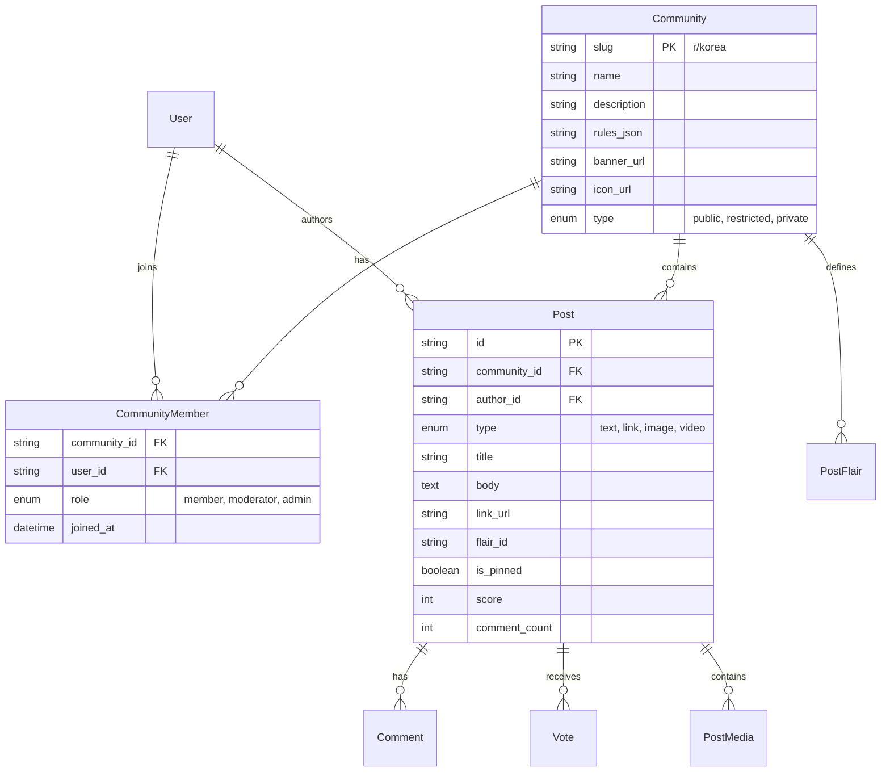

# Spec 023: Subreddit-style Community (r/korea Model)

## 1. Product Goal
To provide a specialized, community-driven platform for Korean IT professionals in Japan, modeled after the intuitive and proven structure of Reddit (specifically `r/korea`). The goal is to move beyond simple "bulletin boards" to "managed communities" that support growth, engagement, and self-regulation.

### Core Value Proposition
- **Managed Context**: Each community (`r/{slug}`) has its own identity, rules, and culture.
- **Scannability**: A dense, media-rich feed that is easy to consume (Cards > Tables).
- **Self-Regulation**: Voting and Moderation tools ensure high-quality content without central bottlenecks.

---

## 2. User Stories

### Member (User)
- As a user, I want to **join/leave** communities so I can customize my home feed.
- As a user, I want to **post (Text, Link, Image)** to a specific community to share information.
- As a user, I want to **flair** my posts so others can filter by topic (e.g., "Visa", "Life").
- As a user, I want to **vote** on posts and comments to help good content rise.
- As a user, I want to **report** content that violates community rules.

### Moderator (Mod)
- As a mod, I want to **customize** my community (Banner, Icon, Description, Rules).
- As a mod, I want to **review reported content** in a queue and take action (Approve, Remove).
- As a mod, I want to **pin** important posts to the top of the feed.
- As a mod, I want to **manage flairs** (Post and User flairs) to organize content.

### Admin (System)
- As an admin, I want to **create** official communities (e.g., `r/official`, `r/announcements`).
- As an admin, I want to **ban** malicious users globally across all communities.

---

## 3. Screens & UX

### 3.1 Global Navigation
- **Top Bar**: Search (Context-aware), User Menu (Profile, Settings), Create Post Button.
- **Left Sidebar**: 
    - **Feeds**: Home, Popular, All.
    - **My Communities**: List of joined `r/{slug}`.
    - **Recent**: Recently visited communities.

### 3.2 Community Home (`/r/:slug`)
- **Header**: Large Banner image, Icon, Community Name, "Join/Joined" button.
- **Filters**: Best / Hot / New / Top (Day/Week/Month/All).
- **Feed**: List of `PostCard` components.
    - **PostCard**: Vote controls (left), Content summary (center), Thumbnail (right/large), Action bar (Comments, Share, Save).
- **Right Sidebar**:
    - **About**: Description, Member count, Online count, Created date.
    - **Highlights**: Pinned posts implementation.
    - **Rules**: Accordion list of community rules.
    - **User Flair**: Preview and edit user flair for this community.

### 3.3 Post Detail (`/r/:slug/comments/:id/:seo-slug`)
- **Layout**: Two-column layout (Post + Comments / Sidebar).
- **Content**: Full width text/image/link preview.
- **Comments**: Threaded view (Recurisve) with collapse support.

### 3.4 Mod Dashboard (`/r/:slug/about/modqueue`)
- **Queue**: List of Reported / Unmoderated items.
- **Actions**: Approve (Green check), Remove (Red X + Reason), Spam (Ban).

---

## 4. Feature Scope

### Phase 1: MVP (Usable Foundations)
- **Community**: Create/Edit details (Name, Desc), Join/Leave.
- **Feed**: Global Feed (Home) vs Community Feed.
- **Posting**: Text, Link, Single Image.
- **Interaction**: Up/Down Vote, Comment (2-depth), Sort (New/Hot).
- **Mod**: Basic Report -> Delete flow.

### Phase 2: V1 (Visuals & Organization)
- **Flairs**: Post Flairs (Filterable), User Flairs.
- **Rich Media**: Multi-image Gallery, YouTube Embeds, OpenGraph Previews.
- **Mod Tools**: Mod Queue UI, AutoMod rules (Keywords).
- **Search**: Scoped search (`q=...&community_id=...`).

### Phase 3: V2 (Growth & Refinement)
- **Growth**: Trending Communities, Recommended Flows.
- **Analytics**: Traffic stats for Mods.
- **commercial**: Ads slots, Sponsored posts (Future).

---

## 5. Data Model & Permissions

### 5.1 ER Diagram (Key Entities)

### 5.2 Permissions
| Action | Guest | Member | Moderator | Admin |
| :--- | :---: | :---: | :---: | :---: |
| View Feed | ✅ | ✅ | ✅ | ✅ |
| Join Community | ❌ | ✅ | ✅ | ✅ |
| Create Post | ❌ | ✅ | ✅ | ✅ |
| Edit Own Post | ❌ | ✅ | ✅ | ✅ |
| Delete Own Post | ❌ | ✅ | ✅ | ✅ |
| Pin Post | ❌ | ❌ | ✅ | ✅ |
| Delete Any Post | ❌ | ❌ | ✅ | ✅ |
| Ban User | ❌ | ❌ | ✅ | ✅ |
| Edit Community | ❌ | ❌ | ✅ | ✅ |

---

## 6. Ranking & Sorting Algorithms

### 6.1 Hot Sort (Wilson Score / Time Decay)
Default for community feeds.
- Algorithm: `Score = log10(Ups - Downs) + (Seconds / 45000)`
- Effect: Newer posts need fewer upvotes to beat older high-score posts.

### 6.2 Best Sort (Confidence Sort)
Default for Comment threads.
- Algorithm: Lower bound of Wilson score confidence interval for a Bernoulli parameter.
- Effect: "Safe" best content (high ratio of upvotes) rises, controversial falls.

### 6.3 New
- Simple `ORDER BY created_at DESC`.

---

## 7. Moderation & Abuse Prevention
- **Rate Limiting**: Prevent new accounts from spamming (e.g., 1 post/10min).
- **Report System**: Users flag content -> Enters `ModQueue` -> Mod approves/removes.
- **AutoMod**: Regex matching for forbidden domains/keywords (auto-flag).
- **Shadowban**: Spammers posts visible only to themselves (V2).

---

## 8. Migration Strategy

### 8.1 Current State Analysis
- **Table**: `community_posts`
- **Field**: `category` (string enum: 'general', 'qna', 'review')
- **Structure**: Flat structure, no concept of "Community" entity.

### 8.2 Migration Plan
1.  **Seed Communities**: Create `communities` rows for existing categories.
    *   `r/general`: Matches `category = 'general'`
    *   `r/qna`: Matches `category = 'qna'`
    *   `r/review`: Matches `category = 'review'`
2.  **Schema Update**:
    *   Add `community_id` column to `community_posts` (nullable initially).
3.  **Data Migration (SQL/Script)**:
    *   `UPDATE community_posts SET community_id = (SELECT id FROM communities WHERE slug = 'general') WHERE category = 'general';`
    *   (Repeat for qna, review)
4.  **Cleanup**:
    *   Make `community_id` NOT NULL.
    *   Drop `category` column (or keep as 'flair' for V1).

### 8.3 Backward Compatibility
- During transition, `community.tsx` (Global Feed) will simply query `WHERE community_id IN (...)` instead of `category IN (...)`.
- Old URLs `/community/:id` can redirect to `/r/general/comments/:id` or remain as a global viewer.
